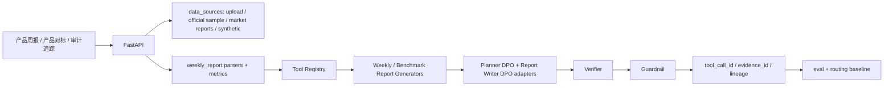

# wealth-research-agent / DPO-aligned 资管产品周报 Agent

Live demo: https://frontend-five-delta-35.vercel.app

面向资管投研、理财产品研究和产品周报工作的可审计 Agent 应用。项目主线不是荐股或交易决策，而是围绕产品周报数据、净值收益、业绩基准、同业产品池、渠道分位和数据源新鲜度，生成：

- 产品情况周报
- 单产品竞品对标
- 全市场/模拟同业池分位对标
- 渠道对标
- 同类绩优产品追踪
- 风险提示与周报摘要

默认只使用 `data/` 下 synthetic/mock/sample 数据。真实接口、LLM、MCP 外部进程和 DPO 训练均为可配置选项；无 API key、无 GPU 时仍可完整运行 demo、测试和评测。

## 核心边界

- 不输出买入、卖出、持有建议，不写推荐配置、保证收益或确定性上涨判断。
- DPO 不用于生成投资建议，只用于对齐周报文风、证据覆盖、风险提示、分位解释和禁用措辞；所有数字仍由 deterministic tools 计算并进入 Verifier/Guardrail。
- 所有数字仍由 deterministic tools 计算或引用 tool output。
- 所有报告仍需 verifier 与 guardrail 检查。
- 不提交 API key、模型权重、adapter 权重、私有语料、真实客户数据或公司内部文件。

## Data Source Strategy

本项目不声称拥有全市场实时产品级数据。默认数据来源分为：

- `historical_business_sample`：历史周报/对标材料仅作为 schema、业务逻辑和回测样本。
- `official_disclosure_sample`：公开官网披露样本，例如公告标题、公告类型、发布日期和产品关键词。
- `public_market_report`：公开行业报告中的市场级统计，不用于产品级分位排名。
- `manual_upload`：用户上传的 Excel/PPT/PDF/CSV，先做 schema preview 和质量检查。
- `synthetic_weekly_snapshot`：基于历史分布和公开市场统计生成的模拟新周报。

所有治理后的记录都要求带：

```text
source_type, source_name, source_url_or_file, fetched_at, as_of_date,
staleness_days, confidence_level, evidence_id, parser_version
```

相关 API：

- `GET /api/data-sources`
- `GET /api/data/freshness`
- `GET /api/data/lineage/{evidence_id}`
- `POST /api/data/refresh-demo`
- `POST /api/data/upload`
- `GET /api/data/upload/{upload_id}/schema-preview`
- `POST /api/data/upload/{upload_id}/confirm-mapping`
- `GET /api/data/upload/{upload_id}/quality-report`

## 周报数据

`scripts/generate_weekly_report_universe.py` 生成周报型 synthetic 产品池：

- `data/weekly/product_weekly_snapshot.csv`：96 个模拟产品，10 个周报日期，共 960 条周快照。
- `data/weekly/product_scale_history.csv`：产品周度规模历史。
- `data/weekly/product_nav_weekly.csv`：周度 NAV 与 benchmark_nav。
- `data/weekly/product_benchmark_status.csv`：业绩比较基准状态。
- `data/weekly/market_issuance_weekly.csv`：市场新发产品周度统计。
- `data/benchmark/peer_product_universe.csv`：360 个模拟同业产品。
- `data/benchmark/peer_product_metrics.csv`：同业收益、回撤、波动、Sharpe 和分位。

新增 synthetic live 生成：

```bash
python scripts/generate_next_week_snapshot.py --as-of-date 2025-04-11 --base-date 2025-04-04 --seed 20260709 --n-products 96
```

输出到 `data/live/`，不会覆盖历史数据。synthetic 数据仅用于 demo，不代表真实全市场排名。

## 架构



默认 workflow 是 deterministic tool pipeline。配置 `OPENAI_COMPATIBLE_API_KEY` 后可以启用 ReAct-capable agent；MCP server 暴露 sample tools，但默认 workflow 不强依赖外部 MCP 进程。

## DPO 主线

项目实现两类 DPO preference data：

- Planner DPO：给定用户任务、产品上下文、可用工具和数据源状态，偏好正确工具选择、正确对标维度、必须进入 verifier/guardrail 的结构化 plan。
- Report Writer DPO：给定 tool outputs，偏好数字一致、证据充分、风险提示完整、无投资建议措辞、符合资管周报文风的摘要。

数据文件：

- `data/dpo/planner_preference_pairs.jsonl`
- `data/dpo/report_preference_pairs.jsonl`
- `data/dpo/hard_negative_rules.yaml`
- `data/dpo/dpo_eval_cases.jsonl`

hard negatives 覆盖：数值幻觉、分位误读、证据缺失、合规违规、风险提示缺失、任务错配、数据源夸大。

训练脚本默认 dry-run：

```bash
python -m backend.app.dpo.dpo_dataset_builder
python -m backend.app.dpo.train_qwen_dpo
python -m backend.app.dpo.train_qwen_sft
python -m backend.app.dpo.eval_dpo_agent_alignment
```

只有设置 `ENABLE_DPO_TRAINING=true`，并通过 CLI 或 `.env` 提供模型路径、数据路径和 adapter 输出路径后，才进入训练分支。TRL/PEFT/QLoRA 相关重依赖不在默认 runtime import。

当前无 adapter 时，eval 标注：

```text
training_status = not_trained
adapter_available = false
```

## 指标与 Verifier

周报指标来自 CSV 工具计算或复算：

- `scale_wow_bn = 本周规模 - 上周规模`
- `scale_mom_bn = 本周规模 - 上月规模`
- `return_1m / return_3m / return_6m / return_1y / return_ytd`
- `max_drawdown / volatility / sharpe`
- `benchmark_status` 按实际年化收益与 `benchmark_lower / benchmark_upper` 判断
- 模拟同业池分位按同类产品 universe 排名
- Product Attention Score：基准未达标、规模下降、低收益分位、回撤恶化、缺失数据加权得到

Verifier 检查：

- 规模变化、收益、回撤、波动是否可由底层数据复算。
- 市场/同业分位是否来自同类 universe。
- 报告数字是否和 tool output 一致。
- 关键结论是否缺少 `evidence_id`。
- synthetic 数据是否被误写成真实全市场数据。
- official disclosure adapter 失败时，报告不得声称“已接入官网实时数据”。
- 是否出现投资建议、收益承诺或确定性判断。

## 前端

顶层导航收敛为三页，面向业务用户展示，不默认暴露 raw JSON 或训练细节：

- 产品周报：周报概览、需关注产品、规模变化、基准未达标、市场发行。
- 产品对标：竞品对标、全市场分位、渠道对标、同类绩优产品。
- 审计追踪：工具调用、数据溯源、报告质检、AI 报告校准。

高风险、证据缺失或质检失败时，人工复核以抽屉形式出现，不作为顶层页面。

## API 快速入口

```text
GET  /health
GET  /api/weekly-report/dates
GET  /api/weekly-report/summary
GET  /api/weekly-report/products
GET  /api/weekly-report/products/{product_code}
POST /api/weekly-report/generate
POST /api/benchmark/peer
POST /api/benchmark/channel
POST /api/benchmark/top-peers
POST /api/eval/run
```

保留旧 demo endpoint：`POST /api/analyze`、`POST /api/analyze/jobs`、`GET /api/reports/{run_id}`。

## 运行

```bash
pip install -r requirements.txt
python scripts/generate_weekly_report_universe.py
python -m backend.app.dpo.dpo_dataset_builder
python scripts/run_weekly_demo.py --report-date 2025-04-04
python scripts/run_product_benchmark_demo.py --product-code WP0031
python -m backend.app.dpo.eval_dpo_agent_alignment
```

`2025-04-04` 是默认静态 demo 的周报日期；Vercel 前端在无后端时读取 `frontend/public/demo-data/` 下的演示数据。

Backend:

```bash
uvicorn backend.app.main:app --reload --port 8000
```

Frontend:

```bash
cd frontend
npm ci
npm run dev
```

打开 `http://127.0.0.1:5173`。

## Vercel

前端已提供 `frontend/vercel.json` SPA rewrite。Vercel 项目建议配置：

```text
Root Directory = frontend
Framework Preset = Vite
Install Command = npm ci
Build Command = npm run build
Output Directory = dist
```

如果后端未部署，前端保留 mock fallback；如果后端已部署，设置：

```text
VITE_WEALTH_AGENT_API_BASE=https://your-backend.example.com
```

后端 serverless 入口为 `api/index.py`；CORS 使用 `ALLOWED_ORIGINS` 环境变量。

## CI

`.github/workflows/ci.yml` 执行：

```bash
python -m compileall backend scripts eval
python scripts/generate_weekly_report_universe.py
pytest
python eval/run_eval.py
python eval/run_route_optimization.py
python eval/run_contextual_bandit.py
python -m backend.app.dpo.dpo_dataset_builder
python -m backend.app.dpo.eval_dpo_report_style
python -m backend.app.dpo.eval_dpo_agent_alignment
cd frontend && npm ci && npm run build
```

## Routing Baseline

Contextual bandit 仅作为 routing baseline，不是项目主卖点。当前 action：

- `fast_weekly_snapshot`
- `standard_weekly_report`
- `deep_product_review`
- `benchmark_only`
- `market_update_only`

结果写入 `eval/contextual_bandit_results.json`，用于展示固定路由、epsilon-greedy 与 LinUCB 的对比。

## 简历 Bullet

- 构建 DPO-aligned 周报型资管产品研究 Agent，基于产品规模、净值收益、业绩基准、同业产品池和渠道分位数据，自动生成产品周报、竞品对标和全市场分位报告。
- 设计 Planner DPO 与 Report Writer DPO 两类偏好数据：前者对齐工具调用计划和审核路径，后者对齐数字一致性、证据覆盖、风险提示、禁用投资建议措辞和资管周报文风。
- 基于 hard negative 构造数值幻觉、分位误读、证据缺失、风险提示缺失、合规违规和数据源夸大样本，使用 Qwen LoRA/QLoRA + TRL DPOTrainer 预留偏好优化训练流程。
- 构建 DPO eval，对比 template / base 或 SFT / DPO 输出在 numeric consistency、evidence coverage、verifier pass rate、forbidden wording rate 和 preference win rate 上的差异。

## 附录：股票研究 Demo

早期股票研究 demo 保留在 `POST /api/analyze` 与相关 sample CSV 中，用于展示 LangGraph/Tool Registry/Verifier 的通用能力；README 主线不再以 `600519` 或贵州茅台作为默认示例。
