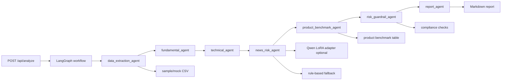

# wealth-research-agent / 资管投研辅助 Agent 系统

面向金融算法、资管投研、理财产品研究实习投递的完整 demo。系统把 sample 行情/净值、模拟基本面与估值字段、新闻风险文本、产品对标表和合规 guardrail 串成一个可运行的投研辅助工作流，用于生成可追溯 Markdown 研究报告。

本项目不是交易系统，不连接真实账户，不输出交易方向，不承诺收益。默认数据全部来自 `data/` 下的 sample/mock CSV，真实接口只作为可配置扩展。

## 业务背景

资管和财富管理投研流程通常需要把多类信息拼在一起：价格/净值表现、基本面质量、相对估值、新闻风险、产品同业对标、报告格式与合规检查。手工整理容易出现口径不一致、指标不可追溯、报告结构不稳定的问题。

`wealth-research-agent` 的定位是把这些步骤拆成可审计工具与 Agent 节点：每个结论都能回到样例数据、指标计算、新闻命中证据或 guardrail 检查。

## 系统架构



后端核心目录：

```text
backend/app/
  agents/
    workflow.py
    data_extraction_agent.py
    fundamental_agent.py
    technical_agent.py
    valuation_agent.py
    news_risk_agent.py
    product_benchmark_agent.py
    risk_guardrail_agent.py
    report_agent.py
  models/qwen_risk_adapter.py
  tools/
    data_loader.py
    metrics.py
    news_risk.py
    product_benchmark.py
  evaluation.py
  main.py
frontend/src/pages/
  ResearchDashboard.jsx
  ProductBenchmark.jsx
  NewsRiskPanel.jsx
  EvaluationPanel.jsx
  PaperReplay.jsx
```

## 运行方式

```bash
pip install -r requirements.txt
python scripts/run_demo.py --symbol 600519 --company 贵州茅台
python eval/run_eval.py
```

启动 API：

```bash
uvicorn backend.app.main:app --reload --port 8000
```

启动前端：

```bash
cd frontend
npm install
npm run dev
```

默认前端会访问 `http://127.0.0.1:8000`。如果后端未启动，页面会回退到本地 mock 预览。

## API

- `GET /health`
- `POST /api/analyze`
- `POST /api/product-benchmark`
- `POST /api/eval/run`

`POST /api/analyze` 示例：

```json
{
  "symbol": "600519",
  "company": "贵州茅台",
  "analysis_type": "full"
}
```

## 样例报告

运行 demo 后会生成：

```text
reports/demo_report.md
```

报告包含：

- 数据与工具调用摘要
- 核心量化指标
- 基本面与估值摘要
- 技术面风险观察
- 同业产品对比样例
- 新闻情绪与风险信号
- 风险提示与可追溯结论

样例片段：

```md
## 7. 风险提示与可追溯结论

- 相对估值样例高于同业中位数，需要拆分质量溢价、成长预期和估值回撤风险。
- 产品池包含较高风险等级样例，展示收益指标时必须同步展示波动、回撤和风险等级。
- 输出仅用于投研辅助、风险摘要、产品对标和研究报告生成，正式使用前保留人工复核与合规校验。
```

## 评测指标

`python eval/run_eval.py` 会写入 `eval/results.json`。当前评测维度：

| 指标 | 含义 |
|---|---|
| tool_call_success | 数据加载、指标计算、新闻风险、产品对标、报告生成是否成功 |
| report_format_pass | 报告是否包含要求的结构化章节 |
| metric_consistency | 核心量化字段是否完整且为有限数值 |
| risk_warning_coverage | 是否覆盖风险提示 |
| forbidden_wording_fail_rate | 禁用交易方向、收益承诺、确定性措辞的命中失败率 |
| avg_latency_ms | 单 case 端到端耗时 |

## Qwen LoRA 风险/情绪 adapter

`backend/app/models/qwen_risk_adapter.py` 提供可选的本地 Qwen LoRA 推理 wrapper：

- 通过 `QWEN_BASE_MODEL_PATH` 和 `QWEN_RISK_ADAPTER_PATH` 配置；
- 本地模型不可用时自动使用规则兜底；
- 输出固定为 `sentiment_score`、`risk_score`、`raw_output`、`model_mode`；
- demo 默认不需要 GPU、外部服务或密钥。

## 合规边界

- 默认只使用 sample/mock 数据。
- 不提交密钥、私有数据、真实客户数据或公司内部文件。
- 报告定位为投研辅助、风险摘要、产品对标和研究报告生成。
- 指标、新闻标签和报告结论分层生成，便于人工复核。
- 真实数据接口、券商接口或公司内部资料只能作为用户本地可配置扩展，不进入仓库。

## 简历 bullet

- 构建 LangGraph 多 Agent 投研辅助系统，串联数据抽取、基本面、估值、技术指标、新闻风险、产品对标、合规 guardrail 与 Markdown 报告生成。
- 实现 FastAPI 服务与 React/Vite 前端工作台，覆盖研究仪表盘、产品对标、新闻风险、评测面板和教学回放页面。
- 设计 sample/mock 数据与自动化评测，统计 tool call success、报告格式、指标一致性、风险提示覆盖和 guardrail 命中率，保证 demo 可离线运行。
