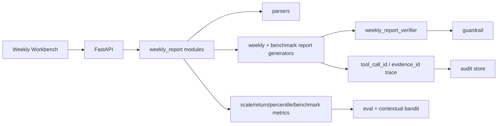

# wealth-research-agent / 周报型资管产品研究 Agent 系统

面向资管投研、理财产品研究和产品周报工作的可审计 Agent 应用。项目主线从泛投研 demo 收敛为“产品情况周报 + 竞品对标 + 市场/渠道分位 + 风险提示 + 审计追溯”的工作台。

默认只使用 `data/` 下 synthetic/mock 数据。真实接口、外部模型、ReAct LLM 和训练流程均为可配置选项；无 API key、无 GPU 时，后端、前端、评测和报告生成仍可完整运行。

## 业务主线

系统输入周报型产品数据、产品净值、同业产品池和市场发行数据，自动生成：

- 产品情况周报
- 单产品竞品对标
- 全市场分位对标
- 渠道对标
- 同类绩优产品追踪
- 风险提示与周报摘要

输出定位为投研辅助、风险摘要、产品对标和报告草稿生成，不作为交易指令或收益承诺。

## 周报数据结构

`scripts/generate_weekly_report_universe.py` 生成周报型 synthetic 数据：

- `data/weekly/product_weekly_snapshot.csv`: 96 个模拟产品，10 个周报日期，共 960 条产品周快照。
- `data/weekly/product_scale_history.csv`: 产品周度规模历史。
- `data/weekly/product_nav_weekly.csv`: 产品周度 NAV 和 benchmark_nav，共 5,568 条。
- `data/weekly/product_benchmark_status.csv`: 周度业绩比较基准状态。
- `data/weekly/market_issuance_weekly.csv`: 市场新发产品周度统计。
- `data/weekly/market_new_product_detail.csv`: 市场新发产品明细。
- `data/benchmark/peer_product_universe.csv`: 360 个模拟同业产品。
- `data/benchmark/peer_product_metrics.csv`: 同业收益、回撤、波动、Sharpe 和分位。
- `data/benchmark/channel_peer_universe.csv`: 渠道维度同业样本。
- `data/benchmark/top_peer_products.csv`: 同类绩优产品追踪样本。
- `data/dpo/weekly_report_preference_pairs.jsonl`: 周报文风 DPO preference pairs。

覆盖产品类型：纯固收、固收增强、多资产、混合类、QDII、现金管理、封闭式、最短持有期型、日开型。覆盖期限、渠道、风险等级和基准状态等常见周报字段。

## 系统架构



默认 demo 使用 deterministic tool pipeline。配置 `OPENAI_COMPATIBLE_API_KEY` 后，可启用 ReAct-capable agent；MCP server 暴露 sample tools，但默认 workflow 不强依赖外部 MCP 进程。

## 指标计算方法

产品周报与对标指标从 `product_nav_weekly.csv` 和同业产品池复算或引用：

- 规模变化：`scale_wow_bn = 本周规模 - 上周规模`，`scale_mom_bn = 本周规模 - 上月规模`。
- 收益表现：`return_1m`、`return_3m`、`return_6m`、`return_1y`、`return_ytd`。
- 风险指标：`max_drawdown`、`volatility`、`sharpe`。
- 基准状态：实际年化收益与 `benchmark_lower` / `benchmark_upper` 区间比对。
- 全市场分位：按同类产品 universe 对 `return_3m`、`max_drawdown`、`sharpe` 排名。
- 渠道对标：按渠道和产品类型统计同业样本数量、3M 收益均值和规模合计。

每条关键结论必须带 `evidence_id` 或 `tool_call_id`，数值结论由 verifier 复算或从 tool output 引用。

## API

核心周报 API：

- `GET /api/weekly-report/dates`
- `GET /api/weekly-report/summary?report_date=...`
- `GET /api/weekly-report/products?report_date=...`
- `GET /api/weekly-report/products/{product_code}`
- `POST /api/weekly-report/generate`
- `POST /api/benchmark/peer`
- `POST /api/benchmark/channel`
- `POST /api/benchmark/top-peers`

保留上一版 demo API：

- `GET /health`
- `POST /api/analyze`
- `POST /api/analyze/jobs`
- `GET /api/analyze/jobs/{run_id}`
- `GET /api/analyze/jobs/{run_id}/events`
- `GET /api/reports/{run_id}`
- `POST /api/eval/run`

## 前端

顶层导航收敛为三页：

- `WeeklyReportDashboard`: 周报日期、产品系列、产品类型、渠道、风险等级、基准状态筛选；展示总规模、周/月变化、基准达标率、低分位产品和需关注产品。
- `ProductBenchmarkWorkbench`: 竞品对标、全市场分位、渠道对标、同类绩优产品；详情抽屉展示 NAV 曲线、benchmark 曲线、风险事件和指标追溯。
- `AgentTraceView`: 展示 run_id、planner plan、tool calls、evidence_id、verifier、guardrail、DPO chosen/rejected 和 contextual bandit eval。

Human review 只在 `pending_review` 时作为 drawer/modal 出现，不再作为顶层页面。

## Verifier

`backend/app/weekly_report/weekly_report_verifier.py` 校验：

- 周规模和月规模变化是否能由规模历史复算。
- `return_3m`、`max_drawdown`、`volatility` 是否来自周度 NAV。
- 市场分位是否来自同类产品 universe。
- `benchmark_status` 是否符合基准上下限规则。
- 报告数字是否和 tool output 一致。
- 是否缺少 `evidence_id`。
- 是否出现配置导向、收益承诺或确定性未来判断。

## DPO Preference Data

DPO 在本项目中只定位为“周报文风对齐”的数据准备与校验，不默认训练。

示例结构：

```json
{
  "prompt": {"tool_output": {"product_code": "WP0001", "return_3m": 0.006, "evidence_id": "ev_snapshot_WP0001_20250404"}},
  "chosen": "规模变化、收益、基准状态和风险提示均来自 tool output。[evidence_id=ev_snapshot_WP0001_20250404]",
  "rejected": "泛泛描述，缺少数字来源和风险提示。"
}
```

运行：

```bash
python -m backend.app.dpo.eval_dpo_report_style
python -m backend.app.dpo.train_qwen_dpo
```

`train_qwen_dpo.py` 默认只验证数据集；设置 `ENABLE_DPO_TRAINING=true` 且通过 CLI 或 `.env` 提供模型路径、adapter 输出路径后，才进入训练 hook。仓库不提交模型权重。

## Contextual Bandit

周报路由 action：

- `fast_weekly_snapshot`
- `standard_weekly_report`
- `deep_product_review`
- `benchmark_only`
- `market_update_only`

上下文特征包括周报任务类型、基准未达标数量、规模下降数量、产品池规模、收益/回撤分位、缺失 NAV 比例、市场新发数量、延迟预算和人工复核需求。

`eval/run_contextual_bandit.py` 实现 LinUCB，并与 fixed baseline、epsilon-greedy 对比。当前结果写入 `eval/contextual_bandit_results.json`：

- case_count: 96
- best_policy: `linucb_contextual_bandit`
- fixed baseline average_reward: 0.7482
- epsilon_greedy average_reward: 0.7059
- linucb_contextual_bandit average_reward: 0.7659

Reward:

```text
0.20 * tool_call_success
+ 0.20 * metric_consistency
+ 0.15 * risk_warning_coverage
+ 0.15 * evidence_coverage
+ 0.10 * report_format_pass
+ 0.10 * route_match_score
- 0.10 * latency_penalty
- 0.15 * unnecessary_tool_penalty
- 1.00 * forbidden_wording_hit
```

## Run

```bash
pip install -r requirements.txt
python scripts/generate_weekly_report_universe.py
python eval/run_eval.py
python eval/run_route_optimization.py
python eval/run_contextual_bandit.py
python -m backend.app.dpo.eval_dpo_report_style
```

Backend:

```bash
uvicorn backend.app.main:app --reload --port 8000
```

Frontend:

```bash
cd frontend
npm install
npm run dev
```

Open `http://127.0.0.1:5173`.

## Compliance Boundary

- 默认数据全部为 synthetic/mock。
- 不提交 API key、模型权重、私有数据、真实客户数据或公司内部文件。
- 真实接口只能通过 `.env` 或 CLI 参数配置。
- 周报输出只用于投研辅助、风险摘要、产品对标和报告草稿。
- 数字结论必须来自 tool output 或 verifier 复算。
- 关键结论必须带 `evidence_id` 或 `tool_call_id`。
- 正式业务使用前需要人工复核和合规复核。

## Resume Bullets

- 构建资管投研辅助 Agent 系统，基于 Planner + conditional LangGraph 串联产品数据、指标计算、新闻风险、产品对标、Verifier 与 Guardrail，并通过 tool_call_id/evidence_id 实现报告结论可追溯。
- 扩展 100+ 模拟理财产品池与周度净值序列，计算收益、波动、最大回撤、Sharpe、Calmar、benchmark excess 等指标，支持多资产类别、风险等级、期限和渠道筛选。
- 实现 contextual bandit 路由优化，在 fast snapshot、standard research、deep review、product compare、risk-only 等分析路径间动态选择，基于指标一致率、证据覆盖率、风险提示、延迟和合规失败率构建 reward 评估。
