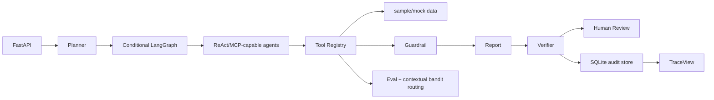

# wealth-research-agent / 资管投研辅助 Agent 系统

面向金融算法、资管投研、理财产品研究实习投递的可审计 Agent 应用雏形。系统默认只使用 `data/` 下 sample/mock 数据；真实接口、外部模型和 ReAct LLM 调用只作为 `.env` 可配置选项。无外部 API key、无 GPU 时，demo、报告、评测和前端仍可完整运行。

项目定位：投研辅助、风险摘要、产品对标、研究报告生成。输出不作为交易指令，不承诺收益。

## Architecture



Key modules:

- `backend/app/agents/workflow.py`: Planner + conditional LangGraph workflow.
- `backend/app/tools/tool_registry.py`: unified auditable tool registry with `tool_call_id` and `evidence_id`.
- `backend/app/tools/product_benchmark.py`: product NAV-based metric calculation and filtering.
- `backend/app/mcp/local_server.py`: local MCP server exposing sample tools.
- `backend/app/agents/verifier_agent.py`: report section, evidence, metric, wording checks.
- `backend/app/storage.py`: SQLite persistence for runs, events, tool calls, reports, evals, reviews.
- `backend/app/optimization/contextual_bandit.py`: LinUCB contextual bandit router.

Default agent mode is a deterministic tool pipeline. If `OPENAI_COMPATIBLE_API_KEY` is configured, the `*_react_agent.py` modules can construct ReAct-capable agents. The MCP server exposes sample tools, but the default workflow does not require an external MCP process.

## Product Universe

`scripts/generate_sample_product_universe.py` generates a synthetic-but-realistic product universe:

- `data/sample_product_catalog.csv`: 108 simulated wealth/asset-management products.
- `data/sample_product_nav.csv`: 4,231 weekly product NAV and benchmark NAV rows.
- `data/sample_product_risk_events.csv`: 209 synthetic risk events.

Coverage:

- Asset classes: 现金管理、纯债固收、固收+、多资产、权益增强、量化对冲、商品/黄金、QDII/全球配置、养老目标/FOF。
- Risk levels: R1-R5.
- Channels: 银行渠道、线上渠道、机构渠道、券商渠道、私行渠道.

Product benchmark metrics are calculated from weekly `nav` and `benchmark_nav`:

- `period_return`
- `annualized_return`
- `annualized_volatility`
- `max_drawdown`
- `sharpe_ratio`
- `calmar_ratio`
- `benchmark_excess_return`
- `win_rate`
- `drawdown_recovery_days`

Legacy `base_nav/latest_nav` logic remains as fallback when the new product NAV files are absent.

## Run

```bash
pip install -r requirements.txt
python scripts/generate_sample_product_universe.py
python scripts/run_demo.py --symbol 600519 --company 贵州茅台
python eval/run_eval.py
python eval/run_route_optimization.py
python eval/run_contextual_bandit.py
```

Backend:

```bash
uvicorn backend.app.main:app --reload --port 8000
```

Frontend:

```bash
cd frontend
npm install
npm run dev
```

Frontend: `http://127.0.0.1:5173`

Backend: `http://127.0.0.1:8000`

## API

- `GET /health`
- `POST /api/analyze`
- `POST /api/analyze/jobs`
- `GET /api/analyze/jobs/{run_id}`
- `GET /api/analyze/jobs/{run_id}/events`
- `GET /api/reports/{run_id}`
- `POST /api/product-benchmark`
- `GET /api/products`
- `GET /api/products/{product_id}`
- `GET /api/products/{product_id}/nav`
- `GET /api/products/{product_id}/risk-events`
- `POST /api/eval/run`
- `POST /api/reviews/{run_id}/approve`
- `POST /api/reviews/{run_id}/edit`
- `POST /api/reviews/{run_id}/reject`

Example:

```json
{
  "symbol": "600519",
  "company": "贵州茅台",
  "analysis_type": "full",
  "risk_preference": "balanced",
  "product_filters": {
    "asset_class": "固收+",
    "risk_level": "R3"
  }
}
```

## Trace And Audit

Every registered tool returns:

```json
{
  "tool_call_id": "tc_product_benchmark_xxx",
  "tool_name": "product_benchmark",
  "input_args": {"risk_level": "R3"},
  "output": {},
  "evidence_ids": ["ev_product_benchmark_12"],
  "latency_ms": 12.3,
  "success": true,
  "error_type": null
}
```

Reports include inline `tool_call_id` or `evidence_id` references. `TraceView` shows planner output, tool calls, agent events, verifier result, guardrail result, and advanced eval summaries.

## Eval And Routing

Report eval:

- `eval/eval_cases.json`: 20 cases.
- `eval/results.json`: tool success, format pass, metric consistency, evidence coverage, risk warning coverage, wording failure rate.

Route eval:

- `eval/route_eval_cases.json`: 15 route cases.
- `eval/route_optimization_results.json`: baseline route reward.

Contextual bandit:

- `eval/contextual_bandit_cases.json`: 90 cases covering stock research, product comparison, risk-only summaries, high-risk news, missing data, empty product pool, low-latency and extreme-volatility scenarios.
- `eval/contextual_bandit_results.json`: compares `fixed_standard_research`, `epsilon_greedy`, and `linucb_contextual_bandit`.

Current contextual bandit summary:

- Best policy: `linucb_contextual_bandit`.
- `fixed_standard_research` average reward: 0.6940.
- `epsilon_greedy` average reward: 0.7210.
- `linucb_contextual_bandit` average reward: 0.7518.

Reward:

```text
0.20 * tool_call_success
+ 0.20 * metric_consistency
+ 0.15 * risk_warning_coverage
+ 0.15 * evidence_coverage
+ 0.10 * report_format_pass
+ 0.10 * route_match_score
- 0.10 * latency_penalty
- 0.15 * unnecessary_tool_penalty
- 1.00 * forbidden_wording_hit
```

## Frontend

Top-level navigation is intentionally limited to:

- `ResearchDashboard`: analysis, report preview, and merged news risk tab.
- `ProductBenchmark`: filters, product table, NAV/benchmark detail drawer, risk events, scatter plot.
- `TraceView`: audit trace, verifier/guardrail, advanced eval and contextual bandit results.

Human review appears as a drawer only when a run enters `pending_review`.

## Docker

```bash
docker compose up --build
```

## Compliance Boundary

- Default data mode is sample/mock only.
- No API keys, model weights, private data, real customer data, or internal company files are committed.
- Real connectors must be enabled through environment configuration.
- Numeric report conclusions must come from tool output or verifier-checked metrics.
- Report conclusions must carry `tool_call_id` or `evidence_id`.
- Formal use requires human review and compliance review.

See:

- `docs/MIGRATION_REPORT.md`
- `docs/ARCHITECTURE.md`
- `docs/EVAL_METHOD.md`
- `docs/COMPLIANCE_BOUNDARY.md`

## Resume Bullets

- 构建资管投研辅助 Agent 系统，基于 Planner + conditional LangGraph 串联产品数据、指标计算、新闻风险、产品对标、Verifier 与 Guardrail，并通过 tool_call_id/evidence_id 实现报告结论可追溯。
- 扩展 100+ 模拟理财产品池与周度净值序列，计算收益、波动、最大回撤、Sharpe、Calmar、benchmark excess 等指标，支持多资产类别、风险等级、期限和渠道筛选。
- 实现 contextual bandit 路由优化，在 fast snapshot、standard research、deep review、product compare、risk-only 等分析路径间动态选择，基于指标一致率、证据覆盖率、风险提示、延迟和合规失败率构建 reward 评估。
