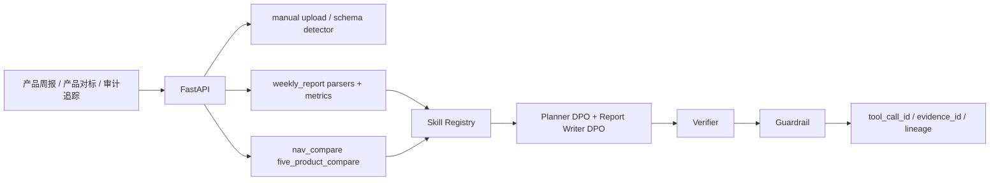

# wealth-research-agent / DPO-aligned 周报型资管产品研究 Agent 系统

Live demo: https://frontend-five-delta-35.vercel.app

面向资管投研、理财产品研究和产品周报工作的可审计 Agent 工作台。项目主线不是荐股、交易或下单，而是围绕产品周报、净值表现、同业产品池、渠道分位、上传数据和报告质检，生成产品周报、竞品/全市场/渠道对标、5只产品净值对比和 DPO 报告校准结果。

## 核心能力

- 可上传 CSV/XLSX：前端 Vercel demo 默认在浏览器本地解析，识别 sheet、字段、前 20 行预览、缺失字段、日期格式、百分比/bp/亿元单位、重复键和数值缺失率；导入记录标记为 `source_type=manual_upload`。
- 产品周报：多日期静态 fallback，展示产品数、总规模、较上周变化、基准达标率、需关注产品 Top 10、规模下降、基准未达标和市场发行概览。
- 产品对标：竞品对标、全市场分位、渠道对标、同类绩优产品追踪。
- 5只产品净值对比：支持 1 个本公司产品 + 最多 4 个竞品，展示原始净值/起点归一化净值曲线，计算收益率、年化收益、年化波动率、最大回撤、Sharpe、Calmar 和 benchmark excess。
- DPO 报告校准：展示 template draft、DPO calibrated draft、chosen/rejected hard negative、Verifier 结果、证据覆盖和禁用措辞命中率。
- 审计追踪：工具调用记录、数据溯源、报告质检、Guardrail 和 Evidence lineage。

## 合规边界

- 不输出买入、卖出、持有、推荐配置、保证收益或确定性上涨判断。
- DPO 不用于生成投资建议，只用于 Planner 任务规划偏好、Report Writer 周报文风、证据覆盖、风险提示、分位解释和禁用措辞规避。
- 所有数字仍由 deterministic tools 计算或从 tool output 引用，并进入 Verifier / Guardrail。
- 不提交 API key、模型权重、adapter 权重、私有语料、真实客户数据或公司内部文件。
- 默认使用 synthetic/mock/sample 数据；真实接口只能通过 `.env` 配置。

## Data Source Strategy

本项目不声称拥有全市场实时产品级数据。默认数据来源分为：

- `historical_business_sample`：历史周报/对标材料仅作为 schema、业务逻辑和回测样本。
- `official_disclosure_sample`：公开官网披露样本，例如公告标题、公告类型、发布日期和产品关键词。
- `public_market_report`：公开行业报告中的市场级统计，不用于产品级分位排名。
- `manual_upload`：用户上传的 CSV/XLSX/PPT/PDF 样本，先做 schema preview 和质量检查。
- `synthetic_weekly_snapshot`：基于历史分布和公开市场统计生成的模拟周报。

所有治理后的记录都要求包含：

```text
source_type, source_name, source_url_or_file, fetched_at, as_of_date,
staleness_days, confidence_level, evidence_id, parser_version
```

## 前端工作台

顶层导航收敛为三页：

- 产品周报：周报概览、导入周报/净值数据、需关注产品、规模变化、基准未达标、市场发行。
- 产品对标：竞品对标、全市场分位、渠道对标、同类绩优产品、5只产品净值对比。
- 审计追踪：工具调用、数据溯源、报告质检、AI 报告校准、质量评估。

Vercel 无后端时读取 `frontend/public/demo-data/`：

- `weekly_dates.json`
- `weekly_summary_2025-01-31.json`
- `weekly_summary_2025-02-05.json`
- `weekly_summary_2025-03-19.json`
- `weekly_summary_2025-04-04.json`
- `weekly_products_*.json`
- `peer_benchmark.json`
- `product_details.json`
- `dpo_eval.json`

## 后端结构



新增工程化模块：

- `backend/app/importers/`：CSV/XLSX schema detector、产品合集、净值序列、同业对标和周报导入。
- `backend/app/nav_compare/`：净值归一化、收益/波动/回撤/Sharpe/Calmar/benchmark excess 计算、5只产品对比。
- `backend/app/skills/`：data upload、weekly summary、peer benchmark、channel benchmark、nav compare、DPO report、Verifier skill registry。
- `config/harness_rules.yaml`：禁用措辞、必需字段、证据规则、数值一致性、数据源边界和周报文风规则。

## DPO 主线

项目实现两类 DPO preference data：

- Planner DPO：给定用户任务、产品上下文、可用工具和数据源状态，偏好正确工具选择、正确对标维度、必须进入 Verifier/Guardrail 的结构化计划。
- Report Writer DPO：给定 tool outputs，偏好数字一致、证据充分、风险提示完整、无投资建议措辞、符合资管周报文风的摘要。

默认不加载真实 adapter：

```text
training_status = not_trained
adapter_available = false
```

前端会显示：“当前为 DPO preference eval demo，未加载真实模型权重。”

## 运行

```bash
pip install -r requirements.txt
python scripts/generate_weekly_report_universe.py
python scripts/export_frontend_demo_data.py
python -m backend.app.dpo.dpo_dataset_builder
python scripts/run_weekly_demo.py --report-date 2025-04-04
python scripts/run_product_benchmark_demo.py --product-code WP0031
python -m backend.app.dpo.eval_dpo_agent_alignment
```

Backend:

```bash
uvicorn backend.app.main:app --reload --port 8000
```

Frontend:

```bash
cd frontend
npm ci
npm run dev
```

打开 `http://127.0.0.1:5173`。

## Vercel 与本地后端

- Vercel 静态 demo：无后端时读取 `frontend/public/demo-data/`，上传文件只在浏览器本地解析并存入 localStorage/session data store。
- 本地后端模式：设置 `VITE_WEALTH_AGENT_API_BASE=http://127.0.0.1:8000`，可调用 FastAPI 的周报、对标、上传预览、数据新鲜度和审计接口。
- 如部署后端，设置 `VITE_WEALTH_AGENT_API_BASE=https://your-backend.example.com`；后端 CORS 使用 `ALLOWED_ORIGINS`。

## API 快速入口

```text
GET  /health
GET  /api/weekly-report/dates
GET  /api/weekly-report/summary
GET  /api/weekly-report/products
GET  /api/weekly-report/products/{product_code}
POST /api/weekly-report/generate
POST /api/benchmark/peer
POST /api/benchmark/channel
POST /api/benchmark/top-peers
POST /api/data/upload
GET  /api/data/upload/{upload_id}/schema-preview
POST /api/data/upload/{upload_id}/confirm-mapping
GET  /api/data/upload/{upload_id}/quality-report
GET  /api/data/freshness
GET  /api/data/lineage/{evidence_id}
```

## 验证

```bash
npm run build
python -m compileall backend scripts eval
pytest
python eval/run_eval.py
```

## 简历 Bullet

- 构建 DPO-aligned 周报型资管产品研究 Agent，支持上传周报/净值/同业对标 CSV 与 Excel，自动完成字段识别、质量检查、证据编号生成，并生成产品周报、竞品对标和全市场分位报告。
- 将实习中的产品合集、净值对比、五只产品业绩比较和数据月报流程工程化，设计 5 只产品净值对比模块，计算收益率、年化波动率、最大回撤、Sharpe、Calmar 和 benchmark excess，并支持起点归一化净值曲线展示。
- 设计 DPO Planner 与 DPO Report Writer 偏好数据，围绕工具调用计划、数字一致性、证据覆盖、风险提示、分位数解释和禁用投资建议措辞构造 hard negatives，并通过 Verifier 自动复核报告质量。

## 附录：早期股票研究 Demo

早期股票研究 demo 保留在 `POST /api/analyze` 与相关 sample CSV 中，用于展示 LangGraph / Tool Registry / Verifier 的通用能力；README 主线不再以股票样例作为默认入口。
