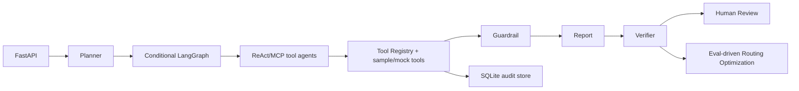

# wealth-research-agent / 资管投研辅助 Agent 系统

面向金融算法、资管投研、理财产品研究实习投递的生产级雏形 demo。系统默认只使用 `data/` 下 sample/mock 数据，真实接口和模型 adapter 只作为 `.env` 可配置选项；无外部 API key、无 GPU 时仍可完整运行。

项目定位：投研辅助、风险摘要、产品对标、研究报告生成。它不是交易系统，也不输出交易方向或收益承诺。

## Architecture



Core backend:

- `backend/app/tools/tool_registry.py`: auditable local tool registry.
- `backend/app/mcp/local_server.py`: local MCP server for sample/mock tools.
- `backend/app/mcp/client.py`: `langchain_mcp_adapters` client helper.
- `backend/app/agents/workflow.py`: Planner + conditional LangGraph workflow.
- `backend/app/agents/*_react_agent.py`: ReAct-capable agents with deterministic fallback.
- `backend/app/agents/verifier_agent.py`: metrics/evidence/report verifier.
- `backend/app/agents/human_review_agent.py`: pending-review state.
- `backend/app/storage.py`: SQLite audit persistence.
- `backend/app/optimization/`: reward and routing policy.

Frontend pages:

- `ResearchDashboard`
- `ProductBenchmark`
- `NewsRiskPanel`
- `TraceView`
- `EvaluationPanel`
- `HumanReview`
- `PaperReplay`

## Run

```bash
pip install -r requirements.txt
python scripts/run_demo.py --symbol 600519 --company 贵州茅台
python eval/run_eval.py
python eval/run_route_optimization.py
```

Backend:

```bash
uvicorn backend.app.main:app --reload --port 8000
```

Frontend:

```bash
cd frontend
npm install
npm run dev
```

Frontend default URL: `http://127.0.0.1:5173`

Backend default URL: `http://127.0.0.1:8000`

## API

- `GET /health`
- `POST /api/analyze`
- `POST /api/analyze/jobs`
- `GET /api/analyze/jobs/{run_id}`
- `GET /api/analyze/jobs/{run_id}/events`
- `GET /api/reports/{run_id}`
- `POST /api/product-benchmark`
- `POST /api/eval/run`
- `POST /api/reviews/{run_id}/approve`
- `POST /api/reviews/{run_id}/edit`
- `POST /api/reviews/{run_id}/reject`

`POST /api/analyze`:

```json
{
  "symbol": "600519",
  "company": "贵州茅台",
  "analysis_type": "full",
  "risk_preference": "balanced"
}
```

## Tool Trace Contract

Every registered tool returns:

```json
{
  "tool_call_id": "tc_calculate_metrics_xxx",
  "tool_name": "calculate_metrics",
  "input_args": {},
  "output": {},
  "evidence_ids": ["ev_metrics_600519"],
  "latency_ms": 12.3,
  "success": true,
  "error_type": null
}
```

Reports include inline `tool_call_id` or `evidence_id` references, and verifier checks numeric consistency against tool output.

## Eval

Report eval output:

```text
eval/results.json
```

Route optimization output:

```text
eval/route_optimization_results.json
```

Reward:

```text
0.25 * tool_call_success
+ 0.25 * metric_consistency
+ 0.20 * risk_warning_coverage
+ 0.15 * evidence_coverage
+ 0.10 * report_format_pass
- 0.10 * latency_penalty
- 1.00 * forbidden_wording_hit
```

## Docker

```bash
docker compose up --build
```

## Compliance Boundary

- 默认只使用 sample/mock 数据。
- 不提交密钥、模型权重、私有数据、真实客户数据或公司内部文件。
- 真实接口只能通过 `.env` 或外部环境变量启用。
- 所有数值结论由 verifier 复核或从 tool output 引用。
- 所有报告结论必须带 `tool_call_id` 或 `evidence_id`。

See:

- `docs/MIGRATION_REPORT.md`
- `docs/ARCHITECTURE.md`
- `docs/EVAL_METHOD.md`
- `docs/COMPLIANCE_BOUNDARY.md`

## Resume Bullets

- 构建 Planner + conditional LangGraph + ReAct/MCP tool agents 的资管投研辅助系统，统一工具调用 trace、证据编号、Verifier 复核和 Human Review 状态。
- 实现 FastAPI + SQLite 审计存储 + React/Vite 工作台，支持研究报告、产品对标、新闻风险、TraceView、评测和审核流。
- 设计 eval-driven routing optimization，使用 reward 评估 fast snapshot、standard research、deep review、product compare、risk-only 等路由策略。
