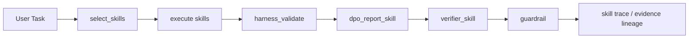
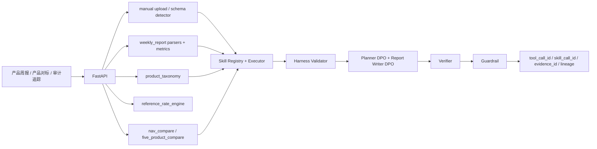

# wealth-research-agent / DPO-aligned Skill-Harness 资管产品周报 Agent

Live demo: https://frontend-five-delta-35.vercel.app

面向资管投研、理财产品研究和产品周报工作的可审计 Agent 工作台。项目主线不是交易、下单或投资建议，而是围绕产品周报、净值表现、同业产品池、渠道分位、上传数据、产品系列归类、基准利率对比和报告质检，生成产品周报、竞品/全市场/渠道对标、5 只产品净值对比和 AI 报告校准结果。

## 核心能力

- 产品周报：多日期静态 fallback，展示产品数、总规模、较上周变化、基准达标率、需关注产品 Top 10、规模下降、基准未达标、市场发行概览。
- 数据导入：支持 CSV/XLSX，本地浏览器解析 sheet、字段、前 20 行预览、字段映射、缺失字段、日期格式、百分比/bp/亿元单位、重复键和数值缺失率。
- dataset_scope 治理：上传时必须选择 `own_company`、`full_market` 或 `reference_rates`，并为每条记录生成 `upload_id`、`source_type=manual_upload`、`parser_version`、`as_of_date` 和 `evidence_id`。
- import_mode 治理：上传时可选择 `merge_with_demo`、`replace_synthetic_for_scope`、`session_only`、`clear_scope_then_import`；勾选 `delete_synthetic=true` 只会清理当前 session/demo store 中对应 scope 的 synthetic 记录，不会删除 GitHub 仓库里的 sample 文件。
- 产品系列归类：基于产品名称、产品类型、期限、风险等级、渠道、发行方和开放类型自动识别系列，支持低置信度复核、手工移动、合并、拆分、重命名和系列业绩重算。
- 产品对标：支持竞品对标、全市场分位、渠道对标、同类绩优产品追踪和 5 只产品净值对比。
- 基准利率对比：支持同期限存款利率、美债利率、中债/国债/同业存单参考收益率和自定义 benchmark basket 的演示数据或上传数据。
- DPO 报告校准：Planner DPO 对齐工具调用计划，Report Writer DPO 对齐周报文风、证据覆盖、风险提示、分位解释和禁用措辞规避。
- Skill-Harness Runtime：将上传、周报摘要、竞品对标、渠道对标、净值对比、DPO 报告和 Verifier 封装为 skill call，并通过 harness 规则检查证据、数值、来源边界和合规措辞。
- 外部核验：默认 disabled + sample fallback，支持局部官方公开净值、官方披露样本、登记编码校验入口和公开参考利率 API 的 adapter 骨架。
- 审计追踪：展示 Tool Trace、Data Lineage、External Verification、Source Coverage、Skill/Harness、报告质检、Guardrail 和 evidence lineage。

## 页面结构

顶层导航收敛为三页：

- 产品周报：周报概览、导入周报/净值数据、产品系列归类、系列业绩对比、基准利率对比、需关注产品、规模变化、基准未达标、市场发行。
- 产品对标：竞品对标、全市场分位、渠道对标、同类绩优产品、5 只产品净值对比。
- 审计追踪：工具调用、数据溯源、报告质检、AI 报告校准、Skill/Harness、质量评估。

## 数据上传 Scope

上传数据不会在 Vercel demo 中发送到公网后端；默认在浏览器本地解析并写入 session/local storage。连接本地 FastAPI 后端时，也会保留同样的 metadata 约束。

| dataset_scope | 用途 | 支持 schema |
| --- | --- | --- |
| `own_company` | 自家公司产品周报、净值、规模和基准状态，用于产品系列归类和内部系列对比 | `product_weekly_snapshot`, `product_nav_weekly`, `product_scale_history`, `product_benchmark_status` |
| `full_market` | 同业/全市场产品池，用于竞品对标、全市场分位、渠道分位和同类绩优产品 | `peer_product_universe`, `peer_product_metrics`, `channel_peer_universe`, `top_peer_products` |
| `reference_rates` | 存款利率、美债利率、中债/国债/同业存单参考收益率和自定义 benchmark basket | `reference_rates` |

每条上传记录必须包含：

```text
upload_id, dataset_scope, source_type=manual_upload, file_name,
parser_version, as_of_date, evidence_id
```

### 删除 synthetic 数据

上传 drawer 支持四种导入模式：

- `merge_with_demo`：默认模式，上传数据覆盖同 code/date 的展示字段，但保留 demo synthetic 数据。
- `replace_synthetic_for_scope`：禁用当前 scope 的 synthetic fallback，并使用上传数据作为该 scope 的主数据。
- `session_only`：当前浏览器 session 只看上传数据。
- `clear_scope_then_import`：清空当前 scope 的 session 记录后再导入。

勾选 `delete_synthetic=true` 时会出现二次确认：

```text
将删除当前 scope 的 synthetic 数据，但不会影响仓库 sample 文件，可通过恢复 demo 数据重置。
```

删除规则：

- `own_company`：清理当前 session 中 `product_weekly_snapshot`、`product_nav_weekly`、`product_scale_history`、`product_benchmark_status` 的 `source_type=synthetic_weekly_snapshot` 记录。
- `full_market`：清理当前 session 中 `peer_product_universe`、`peer_product_metrics`、`channel_peer_universe`、`top_peer_products` 的 `source_type=synthetic_weekly_snapshot` 记录。
- `reference_rates`：清理当前 session 中 `reference_rates` 的 `source_type=synthetic_reference_rates` 记录。

## 产品系列与手工修正

`backend/app/product_taxonomy/` 提供自动归类和手工修正能力：

- `taxonomy_rules.py`：根据产品名称、产品类型、期限、风险等级、渠道、发行方和开放类型生成 `suggested_series_id`、`suggested_series_name`、`confidence`、`classify_reason` 和 `rule_version`。
- `manual_override_store.py`：记录加入、删除、移动、合并、拆分、重命名等操作，生成 `override_id` 和 `evidence_id`。
- `series_performance.py`：重算系列产品数、总规模、规模变化、等权收益、规模加权收益、收益中位数、最大回撤、波动率、Sharpe、基准达标率、低分位产品数和需关注产品数。
- `series_compare.py`：支持多个系列在收益、风险、规模和达标率维度的对比。

前端 `ProductSeriesManager` 展示未归类/低置信度产品、自动识别系列、归类原因和手工调整记录；`SeriesComparePanel` 展示系列表格、收益-风险散点图、系列周报摘要和 AI 报告校准说明。

## 基准利率对比

`data/reference/reference_rates.csv` 和 `backend/app/benchmark/reference_rate_engine.py` 提供参考利率样例和计算逻辑：

- 产品收益减同期限存款利率。
- 产品收益减美债利率。
- 系列规模加权收益减参考利率。
- 产品业绩比较基准上下限与参考利率对比。
- benchmark excess。

演示数据必须标记为 `source_type=synthetic_reference_rates` 或 `manual_upload`。项目不会声称实时抓取官方利率；只有真实 adapter 可用且记录 source metadata 时，才会把来源标记为官方披露或公开市场报告。

## Skill-Harness Runtime

Skill-Harness 将业务流程从“文件配置”升级为可追踪运行时：



每个 skill call 输出：

```text
skill_call_id, skill_name, input, output, timeout_seconds, max_calls,
risk_level, latency_ms, success, evidence_ids, harness_result
```

`config/harness_rules.yaml` 覆盖：

- forbidden wording
- required fields by report type
- required evidence rules
- numeric consistency rules
- source boundary rules
- report style rules

前端审计追踪页的 `Skill / Harness` tab 展示 selected skills、每个 skill 的 input/output/latency/status、harness pass/fail、failed rules、evidence_id 和 source boundary check。

## DPO 主线

本项目把 DPO 放在报告与规划偏好对齐层，而不是让模型负责算数。

- Planner DPO：输入 user task、dataset_scope、available skills、data quality status，输出 selected_skills、required_evidence、verifier_required、guardrail_required。
- Report Writer DPO：输入 deterministic tool outputs，输出周报摘要、系列对比解释、竞品对标解释、基准利率对比解释。
- Hard negatives：覆盖数值幻觉、分位误读、证据缺失、合规违规、风险提示缺失、任务错配、数据源夸大、错误系列归类原因。

默认不加载真实 adapter：

```text
training_status = not_trained
adapter_available = false
```

前端会显示：“当前为 DPO preference eval demo，未加载真实模型权重。”

DPO 不用于生成投资建议。所有收益、回撤、分位、Sharpe、Calmar、benchmark excess 等数字仍由 deterministic tools 计算或从 tool output 引用，并进入 Verifier / Guardrail。

## Data Source Strategy

本项目不声称拥有全市场实时产品级数据。默认数据来源分为：

- `historical_business_sample`：历史周报/对标材料仅作为 schema、业务逻辑和回测样本。
- `official_public_nav`：公开官网净值样本，只覆盖局部产品字段，例如 product_code、latest_nav、cumulative_nav、nav_date。
- `official_disclosure_sample`：公开官网披露样本，例如公告标题、公告类型、发布日期和产品关键词。
- `registry_lookup_sample`：登记编码校验入口；无法自动验证时标记 `manual_check_required` 或 `unknown`，绝不伪造 `verified=true`。
- `public_reference_rate_api`：美债利率、人民币债券曲线或存款利率基准样本/adapter 输出。
- `public_market_report`：公开行业报告中的市场级统计，不用于产品级分位排名。
- `manual_upload`：用户上传的 CSV/XLSX/PPT/PDF 样本，先做 schema preview 和质量检查。
- `synthetic_weekly_snapshot`：基于历史分布和公开市场统计生成的模拟周报。
- `synthetic_reference_rates`：基准利率演示样例，不代表官方实时利率。

所有治理后的记录都要求包含：

```text
source_type, source_name, source_url_or_file, fetched_at, as_of_date,
staleness_days, confidence_level, evidence_id, parser_version
```

### Synthetic vs Uploaded vs Official

- synthetic：只用于 demo、回测和界面交互，不代表真实全市场排名。
- uploaded：用户提供的数据，报告必须写“基于用户上传数据”，并保留 upload_id/evidence_id。
- official/public：来自公开官网样本或公开 API adapter；adapter 默认关闭，启用后仍只表示局部字段核验，不表示全市场覆盖。

## Real Data Adapter Status

真实数据 adapter 位于 `backend/app/data_sources/real_adapters/`，默认关闭：

```bash
ENABLE_REAL_DATA_ADAPTERS=false
```

启用方式：

```bash
ENABLE_REAL_DATA_ADAPTERS=true uvicorn backend.app.main:app --reload --port 8000
```

当前 adapter：

- `official_nav/boc_nav_adapter.py`：公开理财产品净值样本，输出 `source_type=official_public_nav`。
- `official_disclosure/citic_wealth_disclosure_adapter.py`：信银理财信息披露样本，输出 `source_type=official_disclosure_sample`。
- `registry/registry_lookup_adapter.py`：登记编码格式和查询状态入口，无法验证时输出 `manual_check_required` 或 `unknown`。
- `reference_rates/us_treasury_adapter.py`：美国财政部 Fiscal Data API 样本路径，输出 `source_type=public_reference_rate_api`。
- `reference_rates/chinabond_curve_adapter.py` / `chinamoney_curve_adapter.py` / `deposit_rate_adapter.py`：第一版使用本地 sample fallback，可配置 URL 后再接线上源。

约束：

- 不绕过登录、验证码或权限限制。
- 不高频抓取。
- 抓取失败返回 `adapter_status=failed`，不阻塞 demo。
- Vercel 静态前端不直接调用外部源；真实外部源必须通过后端 adapter/proxy。
- 不在前端暴露 API key。

## External Verification / Evidence Graph

`backend/app/external_verification/` 提供局部外部核验：

- 产品代码/登记编码核验。
- 上传净值与 `official_public_nav` 样本比对。
- 参考利率与 `public_reference_rate_api` 样本比对。
- 报告中的“全市场/官方/真实”等措辞做 source boundary 检查。

输出字段：

```text
verified_fields, unverified_fields, conflicting_fields,
official_sources_used, synthetic_fields_used,
verification_score, warnings
```

分数公式：

```text
0.30 * official_nav_coverage
+ 0.20 * disclosure_coverage
+ 0.20 * reference_rate_coverage
+ 0.15 * registry_check_coverage
+ 0.15 * source_freshness_score
- 0.30 * conflict_penalty
```

Source Boundary Guardrail：

- 如果分位数来自 synthetic peer universe，报告必须写“模拟同业池分位”。
- 如果数据来自 manual_upload，报告必须写“基于用户上传数据”。
- 如果 official adapter 失败，报告不得写“已完成官网验证”。
- 如果外部净值字段和上传净值冲突，报告必须降级措辞并提示人工复核。
- 如果 `source_type=synthetic_weekly_snapshot`，禁止写“真实全市场排名”。

## Architecture Inspiration

项目参考金融 AI Agent 的常见工程分层，但只实现投研辅助与周报生成，不做交易执行：

- FinRobot 风格：把 Financial AI Agents、LLM Algorithms、DataOps/LLMOps、多源 LLM 工作流拆成可审计模块。
- FinGPT 风格：按 Data Source、Data Engineering、LLMs、Applications 分层，强调数据治理先于模型输出。
- RAG for finance：上传文档或表格后保留 metadata、schema mapping、structured output 和 evidence lineage。
- FinMem 风格：短期上传上下文、中期产品系列归类状态、长期 manual override memory。

边界说明：

- 不做交易执行。
- 不生成买入、卖出、持有或推荐配置结论。
- 不声称拥有真实全市场实时产品级数据。
- demo 使用 synthetic/manual_upload 数据，并显式标记 `source_type` 与 `evidence_id`。

## Compliance Boundary

- 不输出买入、卖出、持有、推荐配置、保证收益或确定性上涨判断。
- 不做交易执行、下单、申购、赎回或资产配置建议。
- 不声称拥有真实全市场实时理财产品数据。
- DPO 只用于 Planner 偏好、报告文风、证据覆盖、风险提示、分位解释和禁用措辞规避。
- 所有数字仍由 deterministic tools 计算或从 tool output 引用，并进入 Verifier、External Verification 和 Guardrail。
- 不提交 API key、模型权重、adapter 权重、私有语料、真实客户数据或公司内部文件。

## Vercel 与本地后端

- Vercel 静态 demo：无后端时读取 `frontend/public/demo-data/`，上传文件只在浏览器本地解析并存入 session data store。
- 本地后端模式：设置 `VITE_WEALTH_AGENT_API_BASE=http://127.0.0.1:8000`，可调用 FastAPI 的周报、对标、上传预览、数据新鲜度、产品系列、参考利率和审计接口。
- 如部署后端，设置 `VITE_WEALTH_AGENT_API_BASE=https://your-backend.example.com`；后端 CORS 使用 `ALLOWED_ORIGINS`。

静态 fallback 主要文件：

- `weekly_dates.json`
- `weekly_summary_2025-01-31.json`
- `weekly_summary_2025-02-05.json`
- `weekly_summary_2025-03-19.json`
- `weekly_summary_2025-04-04.json`
- `weekly_products_*.json`
- `peer_benchmark.json`
- `product_details.json`
- `reference_rates.json`
- `dpo_eval.json`

## 后端结构



新增工程化模块：

- `backend/app/importers/`：CSV/XLSX schema detector、产品合集、净值序列、同业对标和周报导入。
- `backend/app/product_taxonomy/`：产品系列规则、自动分类、手工修正、系列业绩和系列对比。
- `backend/app/benchmark/`：参考利率加载和产品/系列 benchmark excess 计算。
- `backend/app/nav_compare/`：净值归一化、收益/波动/回撤/Sharpe/Calmar/benchmark excess 计算、5 只产品对比。
- `backend/app/skills/`：data upload、weekly summary、peer benchmark、channel benchmark、nav compare、DPO report、Verifier、skill executor、harness validator、skill trace。
- `backend/app/dpo/`：Planner preference builder、Report preference builder、hard negative generator、DPO/SFT dry-run train scripts 和 alignment eval。

## 运行

```bash
pip install -r requirements.txt
python scripts/generate_weekly_report_universe.py
python scripts/export_frontend_demo_data.py
python -m backend.app.dpo.dpo_dataset_builder
python scripts/run_weekly_demo.py --report-date 2025-03-19
python scripts/run_product_benchmark_demo.py --product-code WP0001
python scripts/run_external_verification_demo.py --product-code AF245408
python -m backend.app.dpo.eval_dpo_agent_alignment
```

Backend:

```bash
uvicorn backend.app.main:app --reload --port 8000
```

Frontend:

```bash
cd frontend
npm ci
npm run dev
```

打开 `http://127.0.0.1:5173`。

## API 快速入口

```text
GET  /health
GET  /api/weekly-report/dates
GET  /api/weekly-report/summary
GET  /api/weekly-report/products
GET  /api/weekly-report/products/{product_code}
POST /api/weekly-report/generate
POST /api/benchmark/peer
POST /api/benchmark/channel
POST /api/benchmark/top-peers
GET  /api/product-taxonomy/classify
POST /api/product-taxonomy/override
GET  /api/product-taxonomy/series-performance
GET  /api/product-taxonomy/series-compare
GET  /api/reference-rates
POST /api/benchmark/reference-rate
POST /api/skills/run
POST /api/external-verification/run
POST /api/data/upload
GET  /api/data/upload/{upload_id}/schema-preview
POST /api/data/upload/{upload_id}/confirm-mapping
GET  /api/data/upload/{upload_id}/quality-report
GET  /api/data/freshness
GET  /api/data/lineage/{evidence_id}
```

## 验证

```bash
cd frontend && npm run build
python -m compileall backend scripts eval
pytest
python eval/run_eval.py
cd frontend && npm run test:smoke
```

## 简历 Bullet

- 构建 DPO-aligned 周报型资管产品研究 Agent，支持上传周报/净值/同业对标/参考利率 CSV 与 Excel，自动完成 dataset_scope 识别、字段映射、质量检查、证据编号生成，并生成产品周报、竞品对标和全市场分位报告。
- 将实习中的产品合集、净值对比、五只产品业绩比较和数据月报流程工程化，设计 5 只产品净值对比模块，计算收益率、年化波动率、最大回撤、Sharpe、Calmar 和 benchmark excess，并支持起点归一化净值曲线展示。
- 实现产品系列自动归类与手工修正机制，支持系列业绩聚合、系列间收益风险对比、基准利率对比和 manual override trace，保证人工调整可复核、可追踪。
- 设计 Skill-Harness Runtime，将上传、周报摘要、竞品对标、渠道对标、净值对比、DPO 报告和 Verifier 封装为可审计 skill call，并通过 harness 规则校验证据覆盖、数值一致性、来源边界和合规措辞。
- 设计 DPO Planner 与 DPO Report Writer 偏好数据，围绕工具调用计划、数字一致性、证据覆盖、风险提示、分位数解释、系列归类原因和禁用投资建议措辞构造 hard negatives，并通过 Verifier 自动复核报告质量。

## 附录：早期股票研究 Demo

早期股票研究 demo 保留在 `POST /api/analyze` 与相关 sample CSV 中，用于展示 LangGraph / Tool Registry / Verifier 的通用能力；README 主线不再以股票样例作为默认入口。
