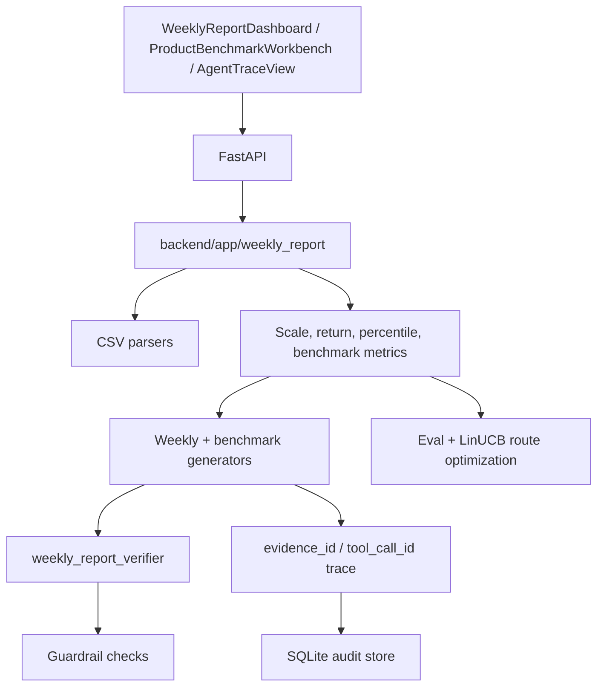

# Architecture

## Current Product Direction

`wealth-research-agent` is now a weekly asset-management product research workbench. The default path uses synthetic weekly product snapshots, product NAV, peer universe and market issuance data to produce weekly summaries, peer benchmarks, market/channel percentiles and audit traces.

## Runtime Flow

## Data Boundary

All committed datasets are synthetic/mock. Attachments may be used to understand schema and reporting workflow, but real rows, customer data, internal files, API keys and model weights are not copied into the repository.

## Agent Boundary

The default demo is deterministic and does not require an LLM. ReAct/MCP code paths are implemented as optional capabilities:

- `create_react_agent` can be enabled when an OpenAI-compatible key is configured.
- Local MCP tools expose sample data only.
- The default workflow does not require an external MCP process.

## Audit Boundary

Every generated report should preserve:

- source file references
- evidence ids for data-derived claims
- tool call ids for tool-derived claims
- verifier result
- guardrail result
- optional human review state
