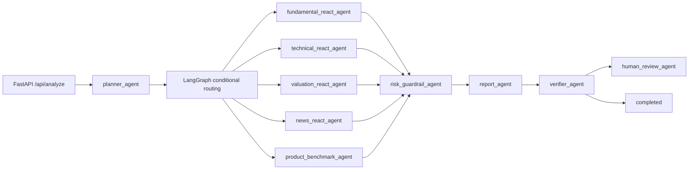

# Architecture

## Runtime Flow

## Key Contracts

- Planner 输出 task type、depth、required tools、skipped tools、risk level、human review hint。
- Tool registry 为所有工具返回统一 trace：`tool_call_id`、`tool_name`、`input_args`、`output`、`evidence_ids`、`latency_ms`、`success`、`error_type`。
- Verifier 复核数值、证据、报告结构和 guardrail。
- SQLite 记录 run、agent events、tool calls、report snapshots、eval results、human reviews。

## Fallback Strategy

- 无 API key：ReAct agent 自动走 deterministic tool pipeline。
- 无 GPU 或无模型文件：Qwen adapter 自动走 rule-based fallback。
- 无外部数据接口：默认使用 `data/` sample/mock CSV。
- 无 blocking interrupt：使用 pending-review 状态和审核 API。
