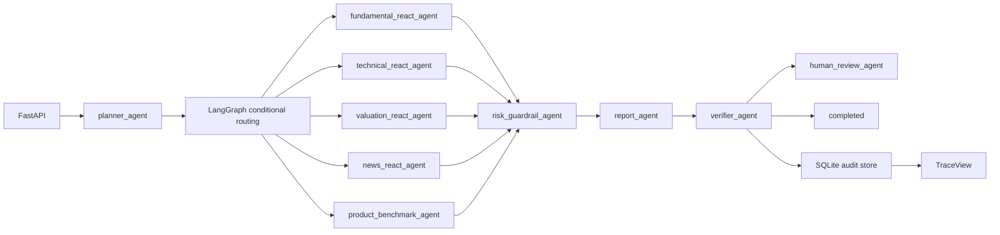
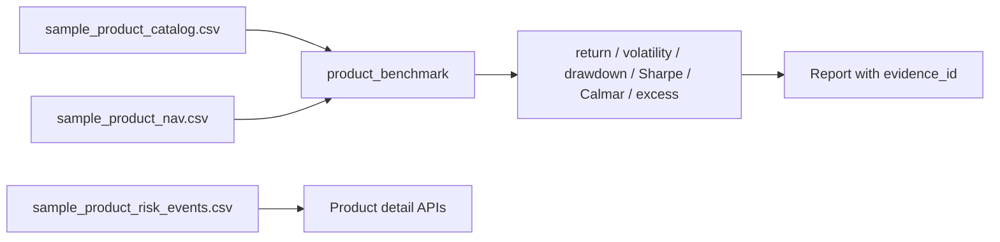

# Architecture

## Runtime Flow

## Product Benchmark Flow

## Key Contracts

- Planner outputs task type, analysis depth, required tools, skipped tools, risk level, and human-review hint.
- Tool registry returns `tool_call_id`, `tool_name`, `input_args`, `output`, `evidence_ids`, `latency_ms`, `success`, and `error_type`.
- Product benchmark rows include metric evidence and source tool-call references.
- Verifier checks metrics, evidence, report structure, product benchmark sourcing, and guardrail wording.
- SQLite records runs, agent events, tool calls, report snapshots, eval results, and human reviews.

## Fallback Strategy

- No API key: ReAct-capable agents use the deterministic tool pipeline.
- No GPU or local model file: Qwen adapter uses rule-based fallback.
- No external data connector: default reads `data/` sample/mock CSV files.
- No blocking LangGraph interrupt: human review uses `pending_review` plus review APIs.
